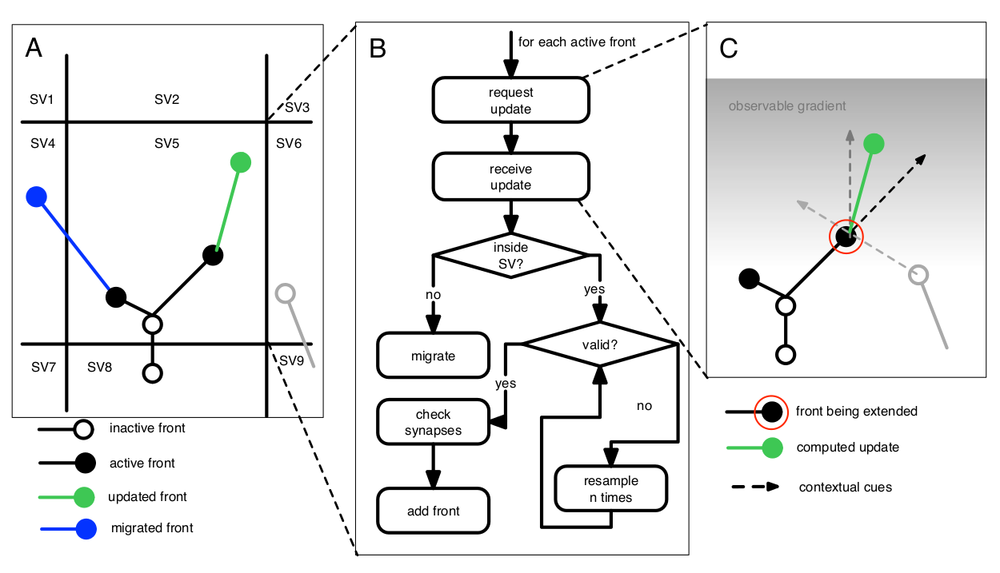

NeuroMac overview
=================

Installation
------------

Required software
~~~~~~~~~~~~~~~~~~

Install the following packages before running NeuroMaC:

- `ZeroMQ <http://zeromq.org/>`_
- `Numpy <http://www.numpy.org/>`_
- `Scipy <http://www.scipy.org/>`_
- `Matplotlib <http://matplotlib.org/>`_

NeuroMaC proper
~~~~~~~~~~~~~~~~

Download the git repository from github:

.. code-block:: bash
   
   $ git clone https://github.com/btorboist/neuromac.git

NeuroMaC consist of a set of scripts, so as long as you give the 
whole path to the scripts no :code:`$PYTHONPATH` is needed. Although, 
when writing your own growth-rules these must be in the :code:`$PYTHONPATH`, 
so that NeuroMaC can find them as shown in :ref:`examples`

.. code-block:: bash
   
   $ PYTHONPATH=<where_my_rules_are>/:$PYTHONPATH python <NeuroMaC_location>/Admin.py <X> <where_my_config_is>/conf.cfg

Where :code:`<X>` is the number of sub volumes to start; this number \
has to be equal to :math:`xa \times ya \times za` (see \
:ref:`config-file`). If :code:`Admin.py` is run with less processes, \
NeuroMaC will complain. If started with more processes, NeuroMaC might \
crash :-)

Design requirements
-------------------

The following requirements guided the design of the NeuroMaC architecture:

#. Generate large numbers of virtual morphologies simultaneously
#. Parallel framework (multi-agent architecture) to cope with computational complexity
#. Virtual morphologies constructed according to growth rules that \
   can be expressed in terms of contextual interactions

.. _neuromac-rationale:

NeuroMaC Rationale
-------------------

Neurons develop in a dense brain substrate where they co-inhabit the
space with other neurons, glia cells, vasculature etc. Clearly, these
space constraints and "interactions" between neurons and other actors
influences the adult morphology. However, when neuronal morphologies 
are studied, they are generally considered
in isolation (i.e., individual neurons) and in a void (i.e., without 
reference to the substrate in which they grew). In previous work we have
shown that some morphological features can not be accounted for by
solely looking at the data of individual neurons in a void ([Torben2008]_).

Indeed, from experimental work it is clear that there is both a genetic component
and an "extrinsic" component to neuronal morphologies. This finding can
be interpreted as if the genetic component contains the blueprint of
a neuron's morphology, but that this blueprint is expressed in terms
of local interactions between a growth-cone and the surrounding substrate.
That is, a neuron contains a set of growth-rules defined as interactions 
between the developing neurons and its environment. This interpretation 
could be used to explain the large observed variance between neuronal morphologies.

We argue that in order to fully understand neuronal morphologies and their
variance we need to investigate the interactions between a developing
neuron and its surrounding substrate. We adopt a computational strategy
because it allows us to systematically analyze the influence of specific
neuron-substrate interactions of the adult morphology and the result
microcircuit. Additionally, a phenomenological approach is suitable to both curb
prohibitive computational costs as well as reducing model complexity. As such, no
biochemical pathways (i.e., signalling pathways) or precise physics 
(i.e., forces) are modeled.

More details can be found here: [Torben2014D]_.

Implementation
--------------

.. warning:: The current version of NeuroMaC is a first prototype as proof-of-principle

.. _fig-neuromac:

   Schematic outline of the NeuroMaC architecture. 

Fronts - Cellular automata
~~~~~~~~~~~~~~~~~~~~~~~~~~

- A morphology grows by repeatedly extending **fronts**, phenomenological implementations
  of growth-cones (:ref:`fig-neuromac`). 
- A neuron consists of many fronts and neurites form in between of fronts,
  either as cylinder (in case the radius of two successive front is equal)
  or frustum (when the radius is different between two successive fronts)
- Fronts contain growth-rules, that is, rules that define the next state
  of a front. The next state can be either an elongation, a branch point, 
  or a termination.
- Growth-rules can be expressed in terms of contextual cues such as
  the direction to (an)other front(s) or they can be independent of
  the context.
- Fronts can thus be seen as some sort of cellular automata in that
  the next state depends on the context.

Volume decomposition - Sub volumes
~~~~~~~~~~~~~~~~~~~~~~~~~~~~~~~~~~~

- The total volume is decomposed into smaller chunks, called **sub volumes**
- Each sub volume is all-knowing about its internals: it keeps track of 
  everything contained in that sub volume such as boundaries, fronts, neurites etc
- Sub volumes check if updated fronts are valid:

  - Is there a structural overlap? If yes: try to resolve by randomly
    sampling a new position in the neighborhood
  - Is a new front location still contained in the sub volume? If no, 
    initiate migration (handled by the *administration agent*, see below).

- Sub volume *asynchronously* query their neighboring sub volumes to get
  the latest info about them. (Read: a developing front potentially  needs to know
  about neurites in adjacent sub volumes in order to correctly use contextual
  cues)
- Sub volumes *synchronously* receive a request from the administration
  agent (see below) to extend all contained fronts.

Multi-agent architecture
~~~~~~~~~~~~~~~~~~~~~~~~

- Each sub volume is implemented as an independent agent in a so-called `multi-agent system <http://en.wikipedia.org/wiki/Multi-agent_system>`_.
- A central administration agent does the housekeeping: decomposing the volume,
  initiating sub volumes, handling migration of fronts between sub volumes,
  collecting and writing output.
- We use `ZeroMQ <http://zeromq.org/>`_, a
  messaging library, to implement NeuroMaC's multi-agent architecture.

Limitations
-----------

Conceptual limitations
~~~~~~~~~~~~~~~~~~~~~~

#. Fronts are static: once a front is assigned a new location, it is \
   there to stay. Retraction of neurites is not supported. Also, front
   cannot move in general after they are placed somewhere.

#. Interactions are "in the eye of the beholder". That is, entities \
   in NeuroMaC (such as neurites, boundaries of places entities) do \
   not possess intrinsic signalling: there is no imposed limitation \
   on what developing fronts can sample. For instance, in case of \
   modeling a secreted/diffusable molecule, there is no imposed maximum \
   distance over which this molecule can be sampled by a developing front. \
   The strength and distance over which a developing front can sample \
   depends on the rules of that front, i.e., the point of view of the \
   beholder. 

#. Branching is always through simulated "cone-splitting" and not through \
   interstitial branching.

Implementation limitations
~~~~~~~~~~~~~~~~~~~~~~~~~~

#. Volumes, sub volumes and virtual substrates are represented by 
   3D rectangles (cuboids). 
#. Two types of boundaries are used: those defined by the volumes (
   and virtual substrates) and those defined as a point cloud, as 
   shown in :ref:`example-pia-attraction`.
#. Volume decomposition affects the results.
#. Reproducibility: Sub volumes work asynchronously by design: sub 
   volumes perform their tasks, which includes communicating with 
   other sub volumes as quick as possible. As a consequence of the between-
   volume communication the sequence of front extensions is not fixed but 
   changes dependent on the available computational resources. In case 
   of several sub volumes (> 2) this leads to unreproducible results.

   To illustrate this issue. Suppose there are three sub volumes that 
   span the total volume from left two right and are numbered 1,2 and 3.
   Now suppose that in both sub volume 1 and 3 a neurite exists whose 
   updated front location is in sub volume 2. Hence, both sub volume 1 
   and 3 initiated the protocol to migrate a front to another sub volume. 
   The administration agents receives both requests in a random order 
   because it is not known in advance whether sub volume 1 or 3 initiates 
   migration first. In the same order as the migration requests are received 
   by the administration agent, this agent will send the requests out 
   and sub volume 2 will receive them in the same random order. Consequently, 
   the order of fronts in the internal store of sub volume 2 depend on 
   the random arrival of the migration requests. As such, while extending 
   both fronts in the next update step, they will receive a random value 
   that depends on their arrival and hence the results depends on the 
   random execution time on sub volumes 1 and 3. The effect of random 
   arrival has further consequences when the sub volumes communicate 
   their state to neighbors and hence sets a whole cascade of hard-to-
   control consequences.

Future road-map
---------------

We are planning a complete rewrite of the software in the next 1-2 years.
Up to that point, the prototype will be used. The following list contains
issue to be addressed in the fully functional version of NeuroMaC.

#. Better description of boundaries and virtual regions (such as laminar
   architecture) by means of surface or volumetric meshes.
#. Reproducibility. Two issues.

   - Exact reproducibility: the same configuration file and growth-rules
     should lead to exactly the same outcome. Due to asynchronous communication
     between sub volumes this is a difficult issue. 
   - Reproducibility independent of volume decomposition: in principle
     the volume decomposition should not affect the results. However, 
     due to the way long-distance interactions (such as a phenomenological
     gradient to the pia in neocortex) are implemented the volume decomposition
     plays a role.
#. Load-balancing. Currently, sub volumes can be distributed over individual
   processors. But in case one sub volume contains much more entities
   than another sub volume, a load-balancing issue occurs because one
   processor is idle while the other is still computing. The central 
   clock for updating fronts is required because otherwise unfair competition 
   (that has nothing in common with biological development) would occur
   between neurites on different processors. Two envisioned ways to overcome
   this load-balancing issues:
   
   #. Dynamic load-balancing
   #. Full multi-agent system where extending a front becomes a service 
      provided by dedicated processors.
#. Differential developmental stages.
#. Time-dependent placement of cues.

References
----------

.. [Torben2008] Torben-Nielsen, B. , Vanderlooy S., Postma EO. Non-parametric
                generation of neuronal morphologies. Neuroinformatics. 2008 
                ;6(4):257-77. (`here <http://www.ncbi.nlm.nih.gov/pubmed/18797828>`_)

.. [Torben2014D] Torben-Nielsen, B. , De Schutter E. *Context-aware modeling of neuronal morphologies*. 
                Neuroinformatics. 2014; 8:92. (`here <http://journal.frontiersin.org/Journal/10.3389/fnana.2014.00092/abstract>`_)

