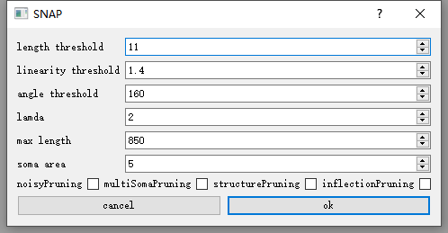

# SNAP tutorial

SNAP is a vaa3d plug-in that contains the whole pruning process. It can prune a single neuron tree or specify multiple somas to split it.

# Outline

1.[Installation](#Installation)

2.[Call through menu](#Menu)

3.[Call through command line](#Command)

4.[License](#License)

# <a name="Installation"></a>Installation

Developer：

1.  Please follow the build instructions here to build released plugins along with the Vaa3d main program:
    https://github.com/Vaa3D/Vaa3D_Wiki/wiki/BuildVaa3d.wiki

2.  Build this Vaa3D plugin following this wiki page: https://github.com/Vaa3D/Vaa3D_Wiki/wiki/CompilePlugins.wiki

User：

1.  Download vaa3d software:
    
    https://github.com/Vaa3D/release/releases/tag/v3.601

2.  Download the snap plug-in, unzip and copy the folder to the plugin directory of vaa3d main program, and you can see the snap plug-in when you open vaa3d again

    https://github.com/Vaa3D/vaa3d_tools/tree/master/hackathon/XuanZhao/SNAP/test/SNAP_dll.zip

# <a name="Menu"></a>Call through menu

1.First, open the main menu of vaa3d, click plugin, find the snap plug-in and click, as shown in the figure below


2.Pruning is used to prune a single tree. First open an image in 3D viewer and drag the. SWC /. ESWC file to the 3D viewer. Then click pruning to open the following dialog box：


The following is an explanation of all parameters：  
| parameter | usage | default |
| --- | --- | --- |
| length threshold | Length threshold for first step pruning | 11 |
| linearity threshold | Linear threshold for first step pruning | 1.4 |
| angle threshold | The angle threshold, which represents the included angle of the bifurcation point, is used for pruning in the third step | 160 |
| lamda | In the second step, the angle is fitted to the parameters of Poisson distribution | 2 |
| max length | Maximum path length between normal tip point and soma point | 850 |
| soma area | In the first step, prune the region near soma. This value represents the range of the region of how many times the radius of soma | 5 |
| noisyPruning | Noise pruning | No |
| multiSomaPruning | Whether it is the case of multiple somas. If so, please mark the positions of other somas with a marker | No |
| structurePruning | Structural pruning | No |
| inflectionPruning | Are abnormal inflection points pruned | No |

Among them, noisyPruning and inflectionPruning need image participation, and multiSomaPruning needs to specify the location of other somas. Generally, the first three items of pruning are selected, and the speed of inflectionPruning is slow.

3.Neurosplit is to split a single tree, mark the position of each soma with a marker, then click neurosplit, wait for a period of time, and the split neurons will be displayed in different colors.

# <a name="Command"></a>Call through command line

The following is a general example of a command line

```
vaa3dPath /x dllpath /f pruning /i swcPath markerNIndexPath imgPath /p lengththreshold linearitythreshold anglethreshold lamda maxlength somaarea noisyPruning multiSomaPruning structurePruning inflectionPruning
```

The /p parameter is consistent with the parameters called through the menu. In /i, swcPath represents the path of SWC or ESWC file, markerNIndexPath is a TXT file, which records the n value of each soma in SWC file or the path of Marker file, and imgPath represents the path of image. For details, please refer to the format of test data.
    
    https://github.com/Vaa3D/vaa3d_tools/tree/master/hackathon/XuanZhao/SNAP/test/SNAP_testData.zip

A function is attached to the command line, which is responsible for converting the. Marker file into a TXT file of the n value of each soma in the SWC file. The call method is as follows:

```
vaa3dPath /x dllpath /f convertMarkers2SomaNList /i swcPath markerPath /o markerNIndexPath
```

# <a name="License"></a>License
