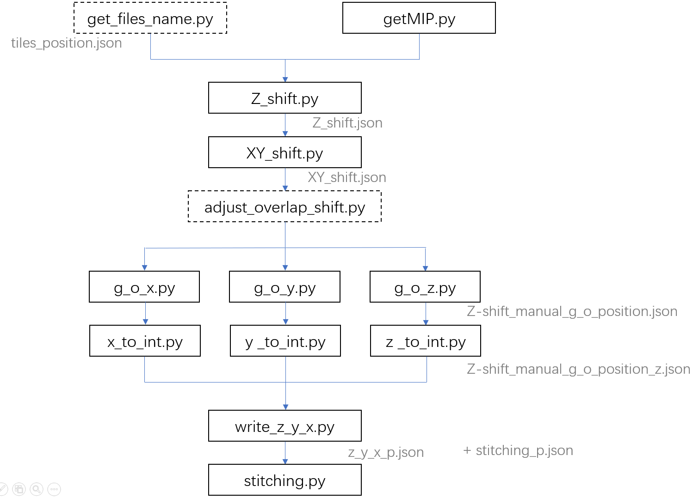
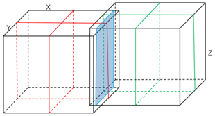

# Instruction Stitching
The process flow chart of stitching is shown below, and the format of the JSON file obtained by each step is referenced in the "para" folder.

# 1. a\_get\_files\_name
Get the relative position of each tile and store it in a JSON file called "tiles_position.json".  If there are no corresponding tiles for a position, "None" is used.  The Json file also holds additional variable information for subsequent operations.

<table>
	<tr>
<td>Variable</td>
<td>Description</td>
</tr>
	<tr>
<td>input_folder</td>
<td>Path of the folder where the MIP image is located required for subsequent calculation of offsets</td>
</tr>
	<tr>
<td>z_result_file</td>
<td>The path to save the JSON file with the Z shift is calculated </td>
</tr>
	<tr>
<td>xy_result_file</td>
<td> The path to save the JSON file with the XY shift is calculated </td>
</tr>
	<tr>
<td>locations</td>
<td>The relative position of all tiles</td>
</tr>
	<tr>
<td>x_length</td>
<td>Pixel length in X direction per slice</td>
</tr>
	<tr>
<td>y_length</td>
<td>Pixel length in Y direction per slice</td>
</tr>
	<tr>
<td>shift_x_P</td>
<td>The initial pixel size of the overlapping area of adjacent tiles set in the left and right relationship</td>
</tr>

<tr>
<td>shift_y_P</td>
<td>The initial pixel size of the overlapping area of adjacent tiles set in the up and down relationship</td>
</tr>
<tr>
<td>shift_x_P_d</td>
<td>Variation range of overlap in adjacent tiles settings of the left and right relationship</td>
</tr>
<tr>
<td>shift_y_P_d</td>
<td>Variation range of shift in adjacent tiles settings of the left and right relationship</td>
</tr>
<tr>
<td>shift_x_P_d_</td>
<td>Variation range of overlap in adjacent tiles settings of the up and down relationship</td>
</tr>
<tr>
<td>shift_y_P_d_</td>
<td>Variation range of shift in adjacent tiles settings of the up and down relationship</td>
</tr>
<tr>
<td>shift_z_P_d_</td>
<td>The Z shift range of the adjacent tiles</td>
</tr>
<tr>
<td>thread_num</td>
<td>The number of threads set to run the program</td>
</tr>
</table>

## 1.1	get\_files\_name.py
According to the original coordinate information of all tiles obtained by the imaging system, a JSON file storing the relative position relationship of all tiles is obtained.  According to the different original coordinate information obtained by different imaging systems, the program needs to be modified slightly. 

The program takes coordinate information shown below as an example, where FieldX represents tile number, PosX and PosY represent physical coordinates in X and Y directions respectively.

	<Tile FieldX="1" FieldY="0" PosX="0.0271577952" PosY="0.0306397943" />

## 1.2	name_position.py (optional)
In order to intuitively represent the relative position of tiles, scatter plots corresponding to the relative position coordinates are drawn according to the original coordinate information of all tiles obtained by the imaging system. 

# 2. b\_get\_MIP
Get the MIP of each tiles (maximum intensity projection).
## 2.1	getMIP.py
The program has 7 functions, the first 3 functions get the MIP image of each tileXY, YZ and XZ plane respectively, and the last 4 functions get the MIP image of overlap area. 

	XY_MIP_function (input, output)
	YZ_MIP_function (input, output)
	XZ_MIP_function (input, output)
	YZ_projection_MIP_L (input, output)
	YZ_projection_MIP_R (input, output)
	XZ_projection_MIP_U (input, output)
	XZ_projection_MIP_D (input, output)

## 2.2	getMIP\_One_folder.py

Obtain the MIP image of all tiles after imaging when all tiles data is placed in a folder. 

# 3. c\_calculate_shift

Calculates the shift in the XYZ direction between adjacent tiles.
## 3.1	Z\_shift.py
Input "tiles_position.json" to obtain the Z\_shift of the adjacent tiles. The result is saved in the "z\_shift. json" file.
## 3.2	XY_shift.py
Calculate the XY shift of adjacent tiles corresponding to the MIP image or to a single plane with Z\_shift taken into account.

## 3.3 improved\_shift.py
The image is preprocessed by iterative denoising so that the program is suitable for dendrite and other sparse signals. 
## 3.4 adjust_overlap\_shift.py
Adjust wrong overlap and shift.
# 4. d\_global_optimization
Perform a global optimization on the calculated Shift so that the corresponding tiles are consistent. 

## 4.1 g\_o_x.py

## 4.2 g\_o_y.py

## 4.3 g\_o_z.py

# 5. e\_float\_to_integer
Make each corresponding plane an integer and obtain the global coordinates of each tiles. 
## 5.1 x\_to_int.py
## 5.2 y\_to_int.py
## 5.3 z\_to_int.py
## 5.4 write\_z\_y_x.py
Save the global coordinates of each tile as well as the pixel length in the XY direction of each tile as a "z_y_X_P. json" file. 
# 6. f_stitching
All tiles are spliced based on the method of pixel fusion, and the file "Stitching_p. json" is used to record the image path to be spliced, the saving path of the result after splicing, the maximum number of planes in the Z direction before splicing, and the number of threads allowed for parallel computation. 

# 7. Need to pay attention to
If a multithreaded program fails, no error message will be displayed. You need to change the program to a single-threaded program first, and then debug the program according to the error message. 